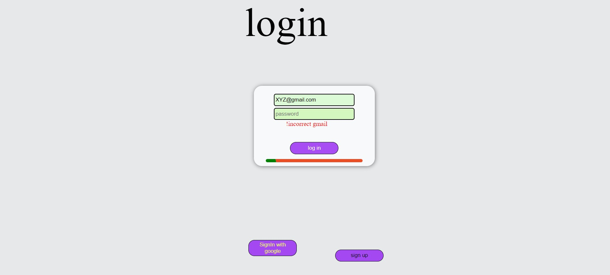

# CreativeNoteBook
Noted website

## IT is a Notes creating website 

### frontend
- [HTML/CSS](https://developer.mozilla.org/en-US/)
- [JavaScript](https://developer.mozilla.org/en-US/)
- [Angular.js](https://angular.io/)
- [Jquary](https://jquery.com/)


### backend 
- [Node js](https://nodejs.org/en/)   
- [Express js](https://expressjs.com/)
- [socket.js](https://socket.io/)
 
- [MongoDB](https://www.mongodb.com/try/download/community) as database
  mongoose as schema for model application
    

## Installation and Setup Instructions

Clone down this repository. You will need `node` and `npm` installed globally on your machine.

Installation:

```
npm install
```

To Start Server:

```
node start

```

To Visit App:

```
http://www.creativenotebook.me

```
#### Instructions
Install Mongodb  and NodeJS
Go through [Instruction](/routes/README.md)


## Project Screen Shot(s)
- Home Page

- Log In Page

- Sign UP Page

- Note Page 

Some Note and Active Users

- Footer


Designed And Developed By [Ankit Ahirwar](https://github.com/aahirwar20)

<p> <a href="https://www.linkedin.com/in/ankit-ahirwar-2006661b3/" target="_blank"></a>&nbsp;&nbsp;&nbsp;&nbsp;</p>

